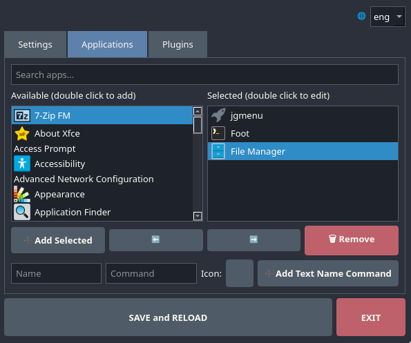
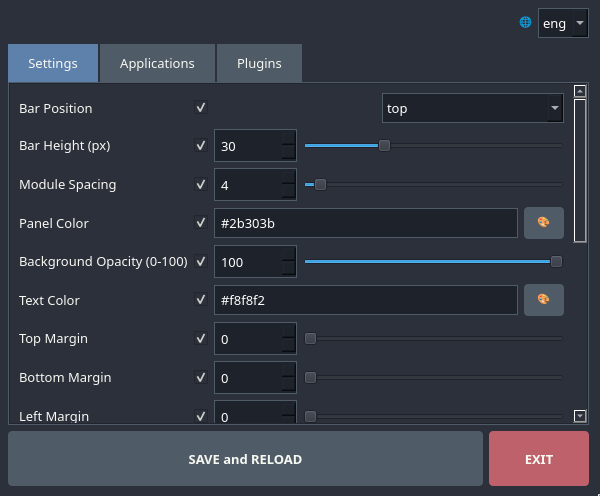
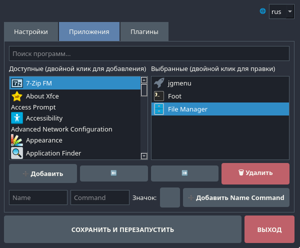

# Qt-Waybar-Gui-Editor-Plugin
Qt Waybar Gui Editor Plugin (QWGEP) small graphical configurator and adding plugins, to add Quick Launch Icons to the left for [Waybar: https://github.com/Alexays/Waybar/] with menu collision checking written in Python 3 using PyQt6. 

! Attention! The application was tested only on ArchLinux!
But it should work in other distributions as well.

libtiff5 may be required

Qt Waybar Gui Editor Plugin (QWGEP) — небольшой графический конфигуратор и добавление плагинов, а так же для добавления "Значков быстрого запуска" влево для [Waybar: https://github.com/Alexays/Waybar/] с проверкой конфликтов в меню, написанный на Python 3 с использованием PyQt6.

!Внимание! Приложение тестировалось только на ArchLinux!
Но должно работать и в других дистрибутивах.

Может потребоваться libtiff5
